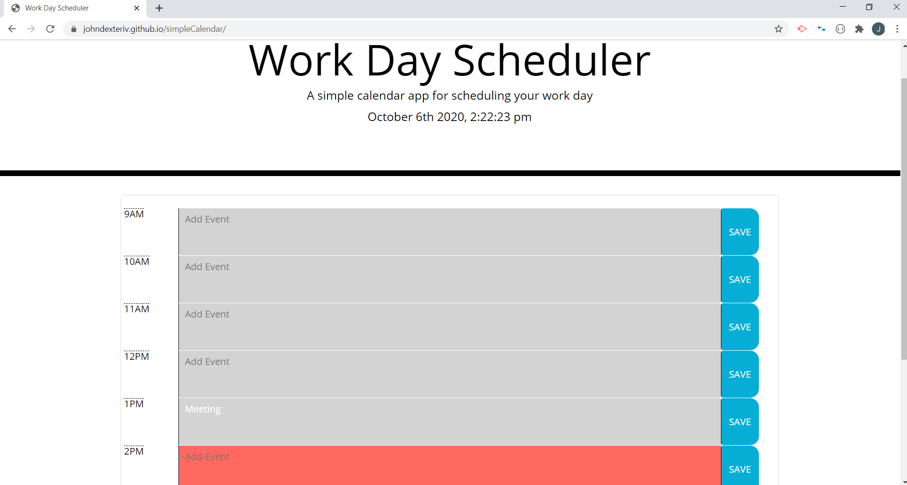

Simple Calendar

When planner is opened 
-	Current day is displayed at the top of the calendar

When scrolling down
-	Time blocks for standard business hours (9 am to 5 pm)
-	Each block is color-coded to indicate past, present or future.
-	Past (Grey)
-	Present(Red)
-	Future(Green)

When time block is clicked
-	User can enter an event
-	When save button on time block is clicked, then that event is saved in local storage.

When page is refreshed
-	Local storage saved data is displayed.

